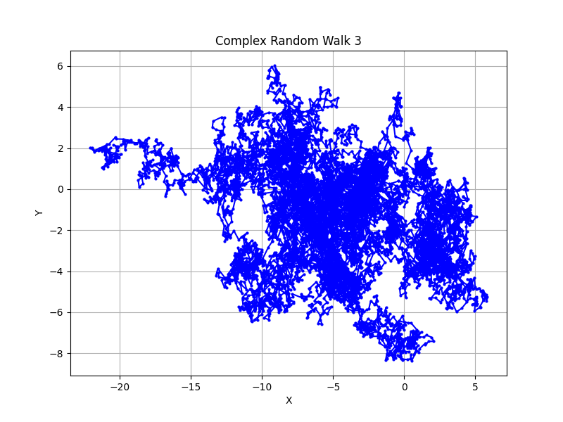
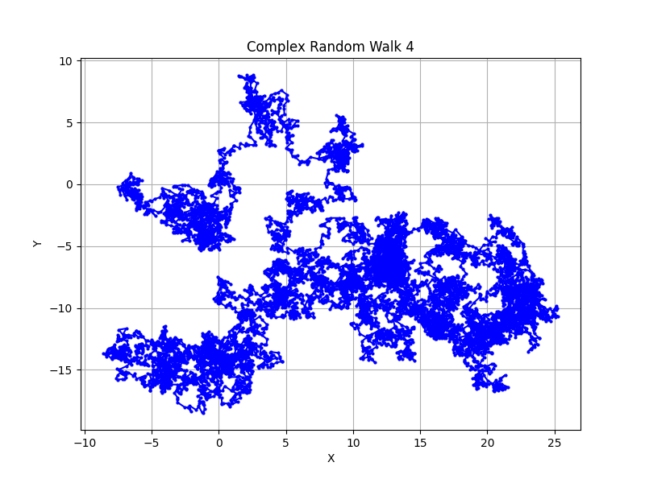
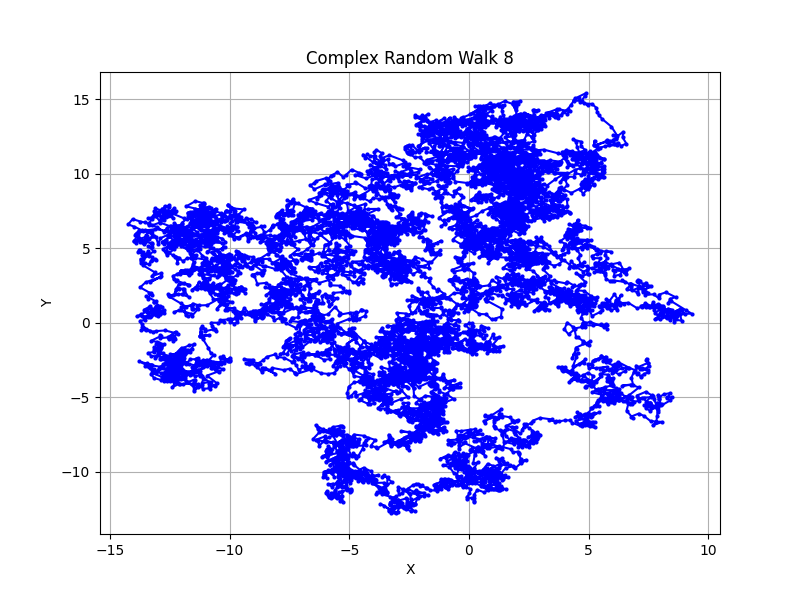
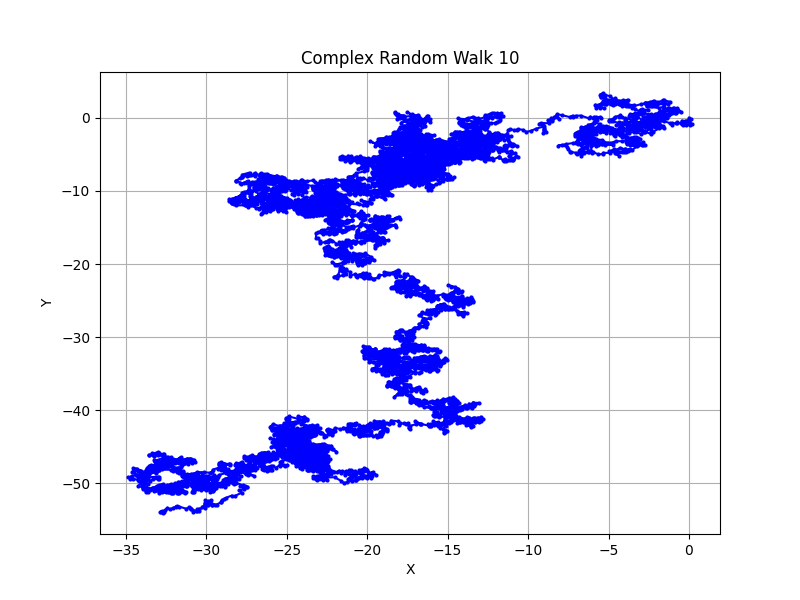

### Understanding Random Walks

A **random walk** is a stochastic or probabilistic process that models the path of an entity (often referred to as a "walker") as it moves through space or time. At each step of the walk, the walker takes a step in a random direction and with a random step size. The key characteristics of a random walk include:

1. **Randomness**: The direction and size of each step are determined by a random process, making the walk inherently unpredictable.

2. **Discreteness**: Random walks are typically discrete, meaning the walker moves in discrete steps, such as on a grid or in time increments.

3. **Accumulation**: The position of the walker at each step is accumulated, resulting in a path or trajectory.

Random walks are used to model various phenomena in different fields, such as:

- **Financial Markets**: Modeling stock prices and asset price movements.

- **Biology**: Describing the motion of molecules in a liquid or the foraging behavior of animals.

- **Physics**: Simulating the behavior of particles undergoing Brownian motion.

- **Computer Science**: Generating random test cases, simulating network traffic, and more.

### The Algorithm for Simulating Random Walks

The algorithm to simulate a random walk involves the following steps:

1. **Initialization**: Start with an initial position. In many cases, this is at the origin (0, 0) for two-dimensional walks.

2. **Randomness**: At each step, introduce randomness to determine the direction and size of the step. This randomness can be achieved using random number generators.

3. **Update Position**: Calculate the new position by adding the step size to the current position in the chosen direction. This can be done in both the x and y directions for two-dimensional walks.

4. **Repeat**: Repeat steps 2 and 3 for a specified number of steps or until a certain condition is met.

5. **Record the Path**: Keep track of the walker's position at each step to record the path or trajectory.

### Visualizing 10 Complex Random Walks

Below are visual representations of 10 complex random walks generated using the Python program:

1. 
2. 
3. 
4. 
5. 
6. 
7. 
8. 
9. 
10. 

Each of these images represents a unique realization of a complex random walk, with variations in step sizes, angles, and added noise, making each path distinctive and unpredictable.

In summary, random walks are a versatile mathematical concept used to model a wide range of phenomena. The algorithm for simulating random walks involves introducing randomness into step sizes and directions, resulting in a diverse set of possible trajectories. The 10 generated images exemplify the unpredictable nature of random walks, demonstrating the concept's utility in various scientific and practical applications.
